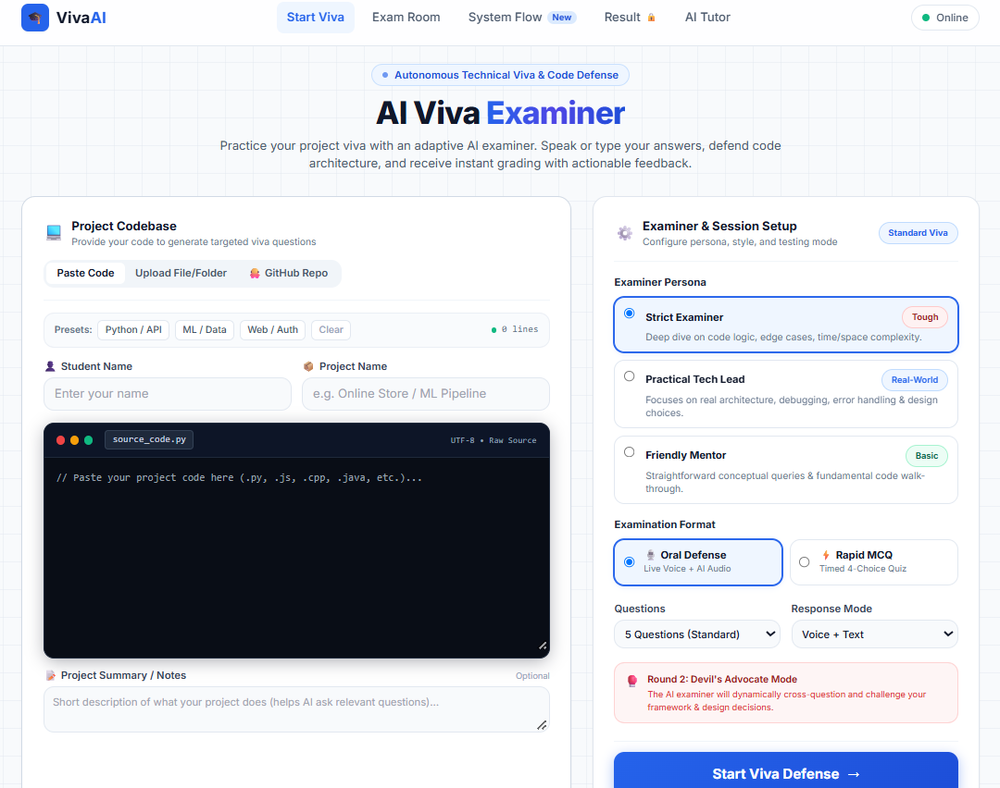
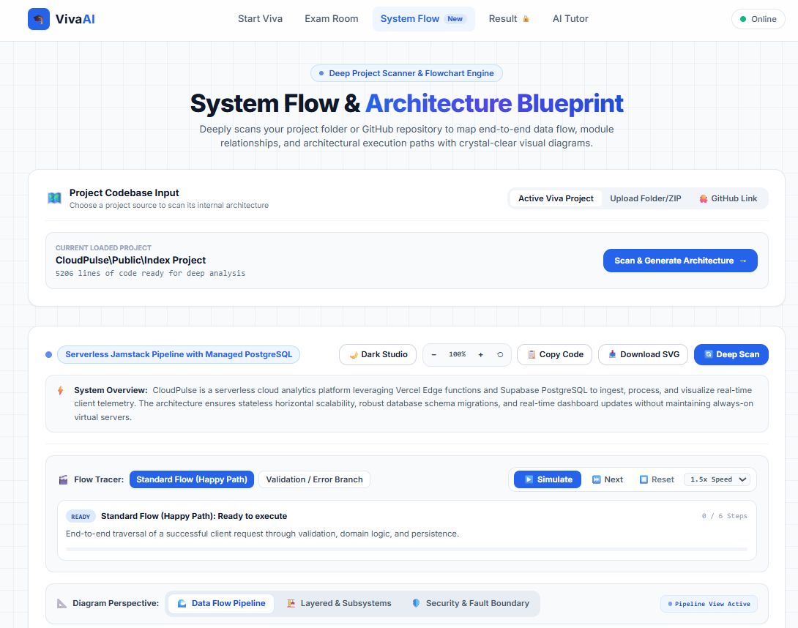
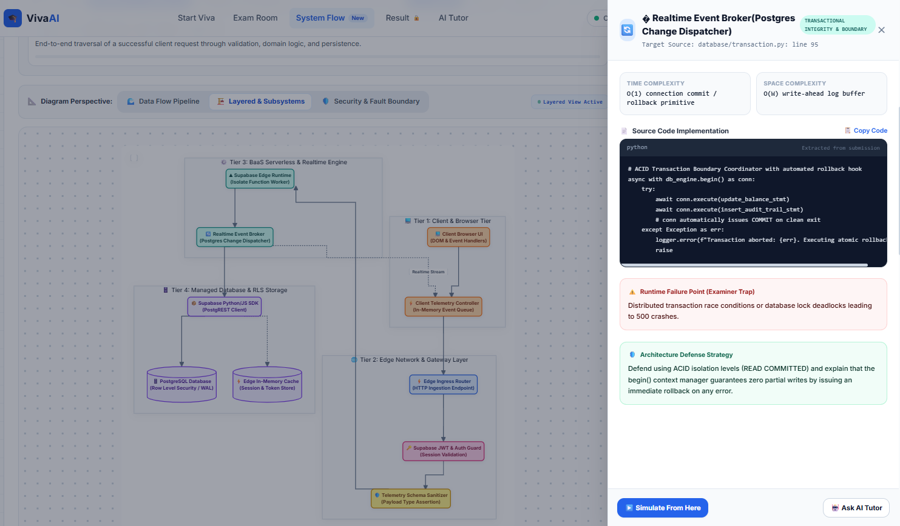
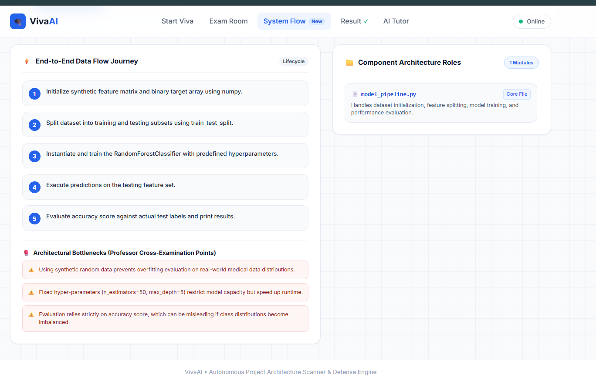
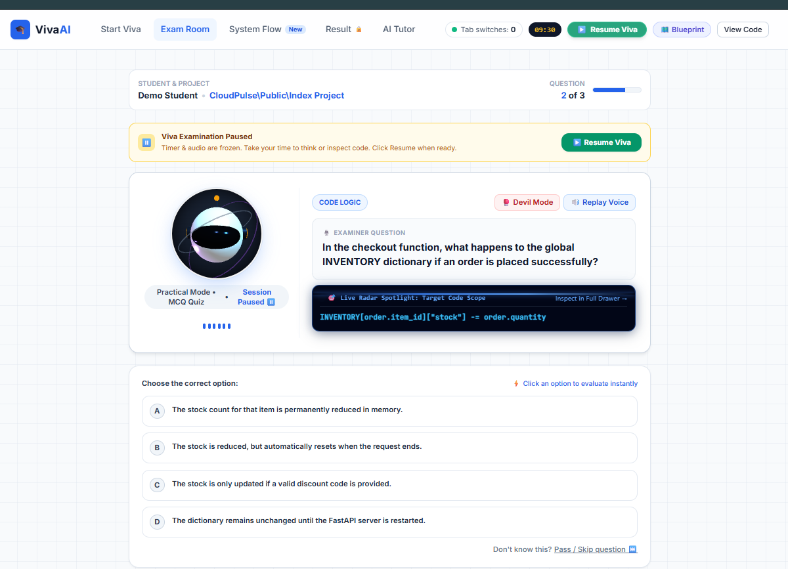
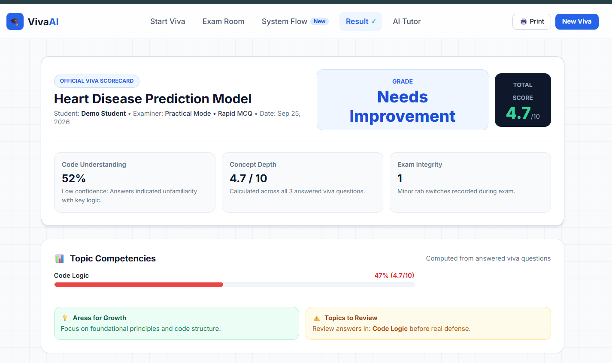
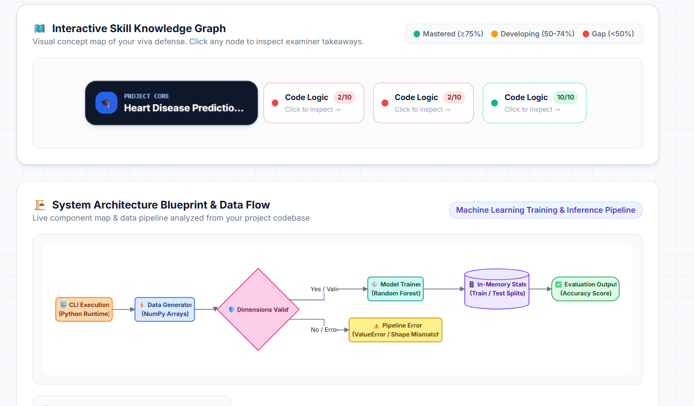
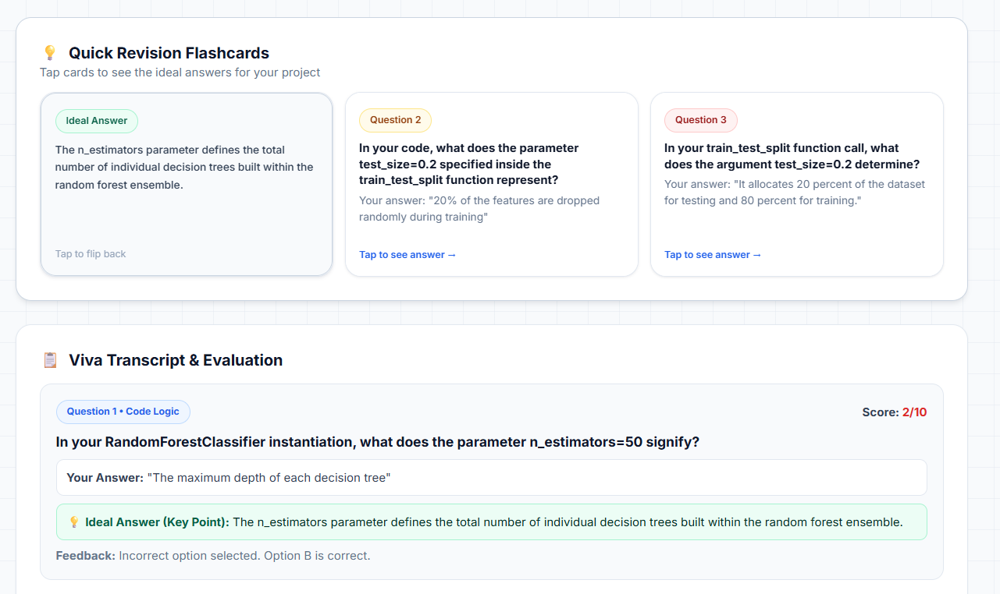
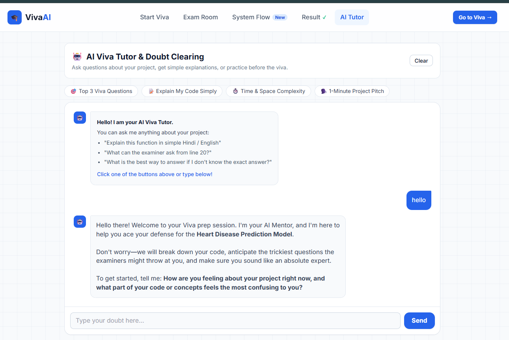

# 🎓 VivaAI — Interactive Project Viva & Architecture Simulator

<p align="center">
  <strong>An interactive defense preparation tool for engineering students. It scans your project code, visualizes the end-to-end data flow, simulates viva questions using voice, and highlights edge cases before your professor asks about them.</strong>
</p>

<p align="center">
  
  
  
  
  
  
</p>

<p align="center">
  
</p>

---

## 💡 The Real Problem

In university project vivas and technical defenses, students often run into the same hurdles:
1. **The code works, but defending it is hard**: Students build projects using tutorials or AI assistants, but get stuck when external examiners ask deep questions:
   - *"What happens if two users hit this checkout button at the exact same millisecond?"*
   - *"Why did you pick this database/library instead of standard alternatives?"*
   - *"What is the worst-case Time and Space complexity here, and where can this code fail?"*
2. **Static architecture diagrams**: Traditional project reports usually contain a basic static image that does not explain how data actually moves through the system or where errors are caught.

**VivaAI** solves this. It scans your source code, generates an **interactive, step-by-step visual data flow diagram**, warns you about **examiner trap questions**, and lets you practice a **voice-driven mock viva** before your actual exam.

---

## 🗺️ System Flow Architecture

```
                    ┌────────────────────────────────────────────────────────┐
                    │                      VivaAI.Pro                        │
                    └───────────────────────────┬────────────────────────────┘
                                                │
       ┌──────────────────┬─────────────────────┼────────────────────┬─────────────────┐
       ▼                  ▼                     ▼                    ▼                 ▼
 ┌───────────┐    ┌────────────────┐     ┌─────────────┐      ┌─────────────┐    ┌───────────┐
 │  / (Home) │    │ /architecture  │     │    /viva    │      │   /report   │    │  /mentor  │
 │ Project   │    │ Interactive    │     │ Live Voice  │      │ Scorecard & │    │ AI Viva   │
 │ Upload    │    │ Flow Tracer    │     │ Examination │      │ Gap Radar   │    │  Copilot  │
 └───────────┘    └────────────────┘     └─────────────┘      └─────────────┘    └───────────┘
```

---

## 🚀 Key Features

| View | Route | What It Does | Key Highlights |
| :--- | :--- | :--- | :--- |
| **Project Setup & Scanner** | `/` | Ingests code from GitHub, ZIP, or folder | Public GitHub scanner, drag-and-drop folder parser, smart junk filter, 1-click presets |
| **System Flow Canvas** | `/architecture` | Visual architecture blueprint & data flow tracer | 3 diagram perspectives (Pipeline, Layered, Security), live token flow simulator, node code drawer |
| **Oral & MCQ Viva Chamber** | `/viva` | Realistic mock viva with voice questions & quiz | Devil's Advocate cross-examination, Rapid MCQ quiz, Edge-TTS audio, anti-cheat tab monitor |
| **Viva Scorecard** | `/report` | Post-viva performance review and marksheet | Authorship confidence score (bluff detector), topic gap radar, 60s flashcards |
| **AI Viva Mentor** | `/mentor` | Personalized doubt-solving lounge | Plain-English code explanations, Big-O coaching, 1-min pitch generator |

---

### 1. 💻 Universal Codebase Scanner & Ingestion Engine (`/`)

<p align="center">
  
</p>

Feed your project to VivaAI in whatever format you have it:

- 🐙 **Public GitHub Repository Scanner**: Simply paste any public repo URL (`https://github.com/username/project`). VivaAI recursively traverses the repository tree, extracts essential architectural modules, and prepares a tailored viva session in seconds.
- 📁 **Full Project Folder & ZIP Ingestion**: Drag and drop an entire local project directory (`webkitdirectory`) or ZIP archive. Built-in client-side smart filters automatically ignore bulky junk folders like `node_modules`, `venv`, `.git`, `__pycache__`, build artifacts, and lock files.
- ⚡ **1-Click Starter Presets**: Test VivaAI instantly with ready-made demo architectures:
  - **Python / API**: FastAPI e-commerce backend with transactional inventory and schema validations.
  - **ML / Data**: Scikit-Learn RandomForest classifier with pipeline vectorizers and train-test splits.
  - **Web / Auth**: Supabase BaaS edge runtime with PostgreSQL Row-Level Security (RLS).

---

### 2. 🌐 Interactive System Flow & Multi-Perspective Architecture (`/architecture`)

<p align="center">
  
</p>

<p align="center">
  
</p>

<p align="center">
  
</p>

- 📐 **3 Architectural Perspectives (Perspective Switcher)**:
  - 🌊 **Data Flow Pipeline**: Sequential end-to-end request lifecycle from client ingress to database persistence and client response envelopes.
  - 🏗️ **Modular Layered Architecture**: Structural N-tier isolation using clean subgraphs for Presentation, Ingress Gateway, Business Domain Core, and Persistence & Cache tiers.
  - 🛡️ **Security & Fault Boundaries**: Zero-Trust defense perimeter mapping rate limiting, TLS termination, cryptographic JWT validation, input schema assertions, and compensating ACID rollback sinks.

- 🎮 **Step-by-Step Flow Tracer (Live Simulation)**:
  - **Happy Path Flow**: Watch a normal request travel from Client $\rightarrow$ API Gateway $\rightarrow$ Validation Guard $\rightarrow$ Domain Service $\rightarrow$ Database $\rightarrow$ Response. Every step lights up with glowing rings and live payload data tickers.
  - **Error Rejection Path**: Simulates what happens when bad or unauthorized data arrives — showing how validation middleware rejects the request before it touches the database.
  - **Playback Controls**: Step Forward, Play/Pause, Replay, and 1x / 1.5x / 2x speed controls.

- 🥊 **Professor Cross-Examination & Viva Defense Counter**:
  - Uncovers the top 3 hidden traps examiners love to probe (such as race conditions, connection pool limits, and single points of failure).
  - Provides an **Ideal Defense Script** with clear talking points to answer confidently.
  - **Neural Voice Playback**: Listen to the defense spoken aloud using Microsoft Edge-TTS with animated sound wave visualizers.

- 🔍 **Click-to-Inspect Node Code Drawer**:
  - Click **any node** across **all 3 diagram perspectives** to slide out its dedicated inspector.
  - **Zero Code Repetition**: Each node displays its own distinct code snippet (Client has frontend fetch, Gateway has routing, Auth has schema validation, Database has queries, Rate Limiter has token buckets, etc.).
  - Shows accurate **Big-O Time Complexity**, **Space Complexity**, failure points, and senior defense scripts.

---

### 3. 🎙️ Live Oral & MCQ Viva Chamber (`/viva`)

<p align="center">
  
</p>

Experience realistic viva conditions tailored to your preparation style:

- 🥊 **Round 2: Devil's Advocate Mode (Grilling Mode)**:
  - The AI examiner doesn't just ask static questions — it dynamically challenges your architectural decisions, questions your library choices, and counter-attacks with real-world failure scenarios to verify if you truly built the project.
- ⚡ **Rapid-Fire MCQ Format**:
  - Want a high-speed knowledge check? Switch from Oral Voice to **Rapid MCQ Mode** for timed, auto-generated 4-choice questions assessing syntax, edge cases, output prediction, and algorithmic bottlenecks.
- 🗣️ **Realistic Examiner Personas**:
  - **Dr. Sharma (Strict External Examiner)**: Deep technical grilling on Big-O complexity, edge cases, and memory limits.
  - **Vikram Rao (Industry Tech Lead)**: Practical probing on real-world scalability, concurrency, error handling, and design choices.
  - **Prof. Ananya (Friendly Mentor)**: Encouraging, conceptual walkthrough of core logic and fundamentals.
- 🎙️ **Voice-to-Voice Interaction**: The examiner speaks questions aloud using Edge-TTS, and you can answer using your microphone (Web Speech API) or by typing.
- 🛡️ **Anti-Cheat Tab Monitor**: Tracks and logs if a student switches tabs during the viva session to search on Google or ChatGPT.

---

### 4. 📊 Viva Scorecard & Authorship Radar (`/report`)

<p align="center">
  
</p>

<p align="center">
  
</p>

<p align="center">
  
</p>

- 🕵️‍♂️ **Code Authorship Meter**: Evaluates whether the candidate genuinely understands the code mechanics or is bluffing using copied code.
- 🎯 **Knowledge Gap Radar**: Visual breakdown showing which areas need review (Concurrency, Architecture, Error Handling, or Algorithmic Complexity).
- ⚡ **60-Second Flashcards**: Quick summary cards to revise critical points right before your actual viva.

---

### 5. 🤖 AI Viva Tutor & Doubt Clearing Lounge (`/mentor`)

<p align="center">
  
</p>

A dedicated 24/7 interactive tutor to resolve code doubts and build confidence before your actual viva:

- 🎯 **Predictive Viva Questions**: Discovers and practices the top questions examiners will ask based on your uploaded codebase.
- 📝 **Plain-English Code Explanations**: Breaks down complex functions and logic into simple, conversational explanations you can speak aloud to your professor.
- ⏱️ **Big-O Complexity Coaching**: Explains time and space complexity in plain terms with practical edge-case examples.
- 🗣️ **1-Minute Project Pitch**: Generates a clear, structured opening introduction to kick off your project presentation with confidence.
- 🔗 **Architecture Canvas Deep-Link**: Clicking *"Ask AI Tutor"* inside any node inspector on `/architecture` instantly pre-fills targeted questions about that component's failure modes and viva defense.

---

## 🛠️ Tech Stack

| Component | Technology | Purpose |
| :--- | :--- | :--- |
| **Backend Framework** | Python 3.10+, FastAPI | High-speed asynchronous REST API |
| **Server Engine** | Uvicorn + WatchFiles | Production ASGI server with hot reloading |
| **Primary AI Model** | Google Gemini Flash | Fast sub-second responses for questions and evaluations |
| **Backup AI Model** | OpenRouter Free Pool | Automatic fallback pool (Llama 3.3, Gemini 2.0) |
| **Voice Synthesis** | Microsoft Edge-TTS | 100% Free, natural human voice (no API key required) |
| **Flowchart Engine** | Mermaid.js v11 | Client-side dynamic SVG flowchart rendering |
| **Archive Unpacker** | JSZip (Browser) | Extracts ZIPs in-browser while filtering junk folders (`node_modules`, `venv`) |
| **Frontend Styling** | Tailwind CSS | Clean, modern white SaaS layout with pastel node themes |

---

## ⚡ Quick Start Guide (4 Steps)

### Step 1: Clone the Repository
```bash
git clone https://github.com/noescape78/AI_VIVA_EXAMINER.git
cd AI_VIVA_EXAMINER
```

### Step 2: Install Dependencies
```bash
pip install -r requirements.txt
```

### Step 3: Configure Environment Variables
Copy `.env.example` to `.env`:
```bash
copy .env.example .env
```
*(On Linux/macOS: `cp .env.example .env`)*

Open `.env` and add your free Google Gemini API key:
```env
GEMINI_API_KEYS=your-gemini-api-key-here
PORT=8000
```
> **Note**: Even if your API key runs out or internet is disconnected, VivaAI has built-in offline fallbacks so the viva simulation and architecture diagrams continue to work smoothly.

### Step 4: Start the Server
```bash
python app.py
```

Open **[http://localhost:8000](http://localhost:8000)** in your browser!

---

## 📂 Project Structure

```
AI_VIVA_EXAMINER/
├── index.html              # Landing page, project upload & 1-click test samples
├── architecture.html       # Flow tracer simulation, viva traps & code inspector drawer
├── viva.html               # Live oral viva chamber with voice & reactive avatar
├── report.html             # Detailed scorecard, authorship meter & flashcards
├── mentor.html             # AI Viva Copilot doubt resolution lounge
├── app.py                  # FastAPI server with dual-key AI auto-failover
├── requirements.txt        # Python dependency manifest
├── .env.example            # Environment variables template
├── sample_projects/        # Built-in demo projects for instant testing
│   ├── ecommerce_checkout.py
│   ├── disease_prediction_ml.py
│   └── jwt_auth_service.js
└── static/
    ├── css/style.css       # Clean styling, glowing pulse nodes & audio equalizer waves
    └── js/app.js           # Flow simulation engine, voice STT/TTS & drawer code
```

---

## 📜 License

This project is licensed under the [MIT License](LICENSE).
